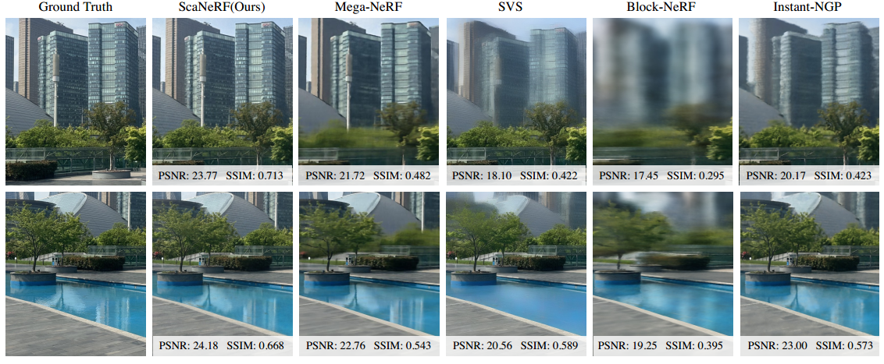

# ScaNeRF: Scalable Bundle-Adjusting Neural Radiance Fields for Large-Scale Scene Rendering




This research combines tile-based hybrid neural fields with parallel distributive optimization to improve bundle-adjusting neural radiance fields.


## Environment 

+ **Operating system:** Ubuntu 18.04

+ **g++/gcc:** 9.4.0

+ **GPU/NVCC:** V100/11.2

+ **Python:** 3.8.0

+ **PyTorch/NumPy:** 1.9.0/1.24.2

  

## Compile

Follow the steps below to compile the code:

```shell
cd cuda 
bash make.sh
```

Compile the code of ray-mesh intersection calculation.
 ```shell
 cd fastMesh
 bash make.sh
 ```

Compile the code of hash grid:
```shell
cd hashgrid 
bash make.sh
```


## Directory Structure

> Root directory of a dataset
>
> > **images:** the directory of captured images with .png format
> >
> > **mesh**: the directory of proxy mesh
> >
> > **logs**: the directory for training logs
> >
> > **camera.log**: camera paramaters file

 


## Preprocess

Allocate tiles for a given scene:

```
python preprocess/build_tiles.py config/[SCENE].yaml [GPU IDX]
```


## Training

Training in parallel: 

```bash
python admm_trainer.py config/[SCENE].yaml
```


## Rendering 

```
python render.py config/[SCENE].yaml [GPU IDX] [SCENE]
```
Here [SCENE] file is inside the log file after training.

## License

 Copyright (C) 2007 Free Software Foundation, Inc. <https://fsf.org/>
 Everyone is permitted to copy and distribute verbatim copies
 of this license document, but changing it is not allowed.

